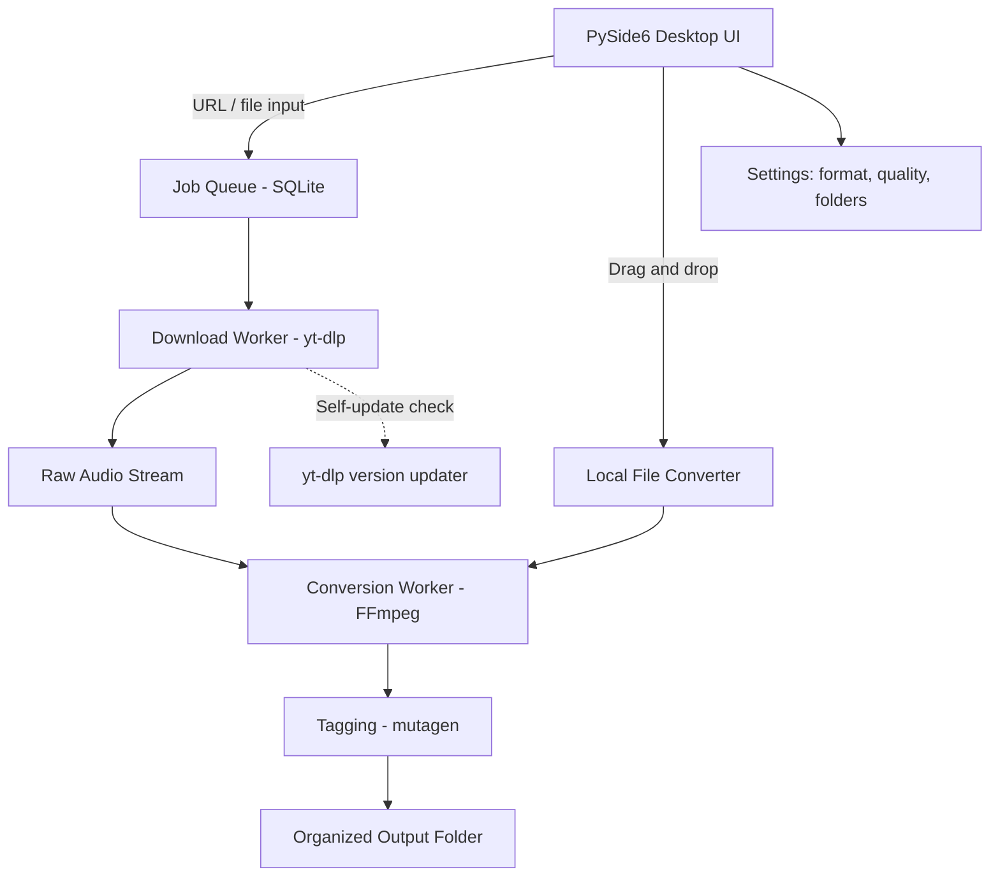

# AudioForge — Desktop Audio Downloader & Converter for Music Production Studios
### Full Project Plan & Research Report
Prepared for: Music Production Studio Client
Author: Lapalu Liyanage

---

## 1. Problem Statement

The studio currently relies on ad-hoc tools (browser extensions, online converters, VLC) to pull reference audio and samples from YouTube for production work, and runs into recurring problems:

- **Inconsistent quality** — most free online converters cap output at 128 kbps MP3, which is unusable for serious mixing/mastering reference.
- **Format limitations** — many tools only export MP3; producers need WAV/FLAC for lossless work in a DAW.
- **Unreliable tools** — browser-based downloaders break often as YouTube changes its player, and some inject ads/malware.
- **No batch or library workflow** — no way to queue multiple tracks, tag them, and drop them straight into a project folder or DAW-watched folder.
- **No production-oriented post-processing** — no built-in normalization, trimming silence, sample-rate/bit-depth conversion, or metadata tagging for a DAW library.

The goal is a **single desktop application** that solves all of this in one clean, reliable tool built specifically around a music production workflow — not a generic "YouTube downloader."

---

## 2. Research Summary

I compared the realistic options for the "download + convert" engine before deciding on an architecture.

| Tool | Formats | Max Quality | Notes |
|---|---|---|---|
| **yt-dlp** | WAV, FLAC, MP3, OGG, M4A, Opus | Best available source stream (YouTube tops out ~256 kbps AAC/Opus) | Free, open-source, actively maintained, scriptable — the clear engine of choice |
| 4K Video Downloader | MP3, FLAC, WAV, OGG | Varies | Desktop GUI, but closed-source and paid for FLAC |
| Browser extensions (DownloadHelper etc.) | MP3 only | 128–256 kbps | Unreliable, ad-heavy, subscription-gated |
| Online converters (Y2Mate, YTMP3, etc.) | MP3 only | Usually 128 kbps | Ads, malware risk, privacy risk (URLs sent to third-party servers), frequently shut down |
| VLC | Varies | Varies | Clunky manual workflow, breaks often on YouTube streams |

**Key finding:** `yt-dlp` paired with `ffmpeg` is the only option that is (a) free, (b) actively maintained, (c) supports every format a studio needs, and (d) extracts the true best available source stream without unnecessary re-encoding loss.

**Important quality caveat:** YouTube's source audio itself is lossy (typically Opus/AAC around 128–256 kbps) — no downloader can produce audio better than YouTube's own encode. Converting to WAV/FLAC preserves that quality losslessly from that point forward but does not "upscale" it. This should be communicated clearly in the app's UI/help text.

**Legal/ethical note:** YouTube's Terms of Service prohibit downloading content without permission. Extracting audio is a legal gray area in most jurisdictions when used for personal reference, practice, or non-distributed production work — but it is not a license to redistribute or monetize downloaded copyrighted material. The plan includes a licensing/usage disclaimer shown on first launch, and the app should be positioned internally as a **reference/sketch tool**, not a way to source final commercial masters.

---

## 3. Recommended Tech Stack

| Layer | Choice | Why |
|---|---|---|
| Core engine | **yt-dlp** (Python library) + **FFmpeg** | Battle-tested extraction + conversion |
| App shell | **PySide6 (Qt for Python)** | Native, fast, packages into a single installable desktop app; pure Python |
| Alternative shell | Tauri + React (not chosen) | Adds packaging complexity, only worth it for a highly custom web-style UI |
| Packaging | **PyInstaller** + Inno Setup | Produces a single `.exe`/installer for Windows |
| Metadata/tagging | **mutagen** | Write ID3/Vorbis tags |
| Local library/queue | **SQLite** | Lightweight download-history and queue database |

---

## 4. Target Users & Use Cases

- Studio producers pulling **reference tracks** for arrangement/mix comparison
- Sound designers pulling **raw sample material** (with appropriate rights/permissions)
- Assistants building a **research library** of songs for a project
- Anyone needing quick **format conversion** of existing local audio files for DAW compatibility

---

## 5. Functional Requirements (MVP)

1. Paste a YouTube URL (single video or playlist) → fetch title, thumbnail, duration, channel for confirmation before downloading
2. Choose output format: WAV / FLAC / MP3 (320kbps) / M4A / Opus
3. Choose sample rate & bit depth for WAV/FLAC (44.1kHz/16-bit, 48kHz/24-bit, etc.)
4. Batch queue with progress bars, pause/resume, retry-on-failure
5. Auto-tag output files (title, artist/channel, source URL, download date) via mutagen
6. Auto-organize output into a folder structure (e.g., `/Downloads/<Studio Project>/<Track>.wav`)
7. Optional local file converter (drag-and-drop existing audio files to convert formats)
8. Built-in disclaimer/usage notice on first run
9. Simple, clean UI — minimal, dark-themed, keyboard-friendly

## 6. Phase 2 (Post-MVP) Features

- Loudness normalization (LUFS target) on export
- Silence trimming at start/end
- "Send to DAW" watch-folder integration
- Basic waveform preview before download
- Auto-update mechanism for the app and for yt-dlp
- Optional stem separation integration (stretch)

---

## 7. Non-Functional Requirements

- Reliability: gracefully handle yt-dlp/YouTube extractor breakage; in-app "update engine" button
- Performance: background threads, UI never freezes
- Portability: primary target Windows; optional macOS later
- Offline-safe: only the download step needs internet
- No telemetry/tracking

---

## 8. Architecture Overview

---

## 9. Development Roadmap

| Phase | Duration (est.) | Deliverable |
|---|---|---|
| 1. Setup & Spike | 1 week | PySide6 skeleton app + yt-dlp/ffmpeg proof-of-concept download & convert |
| 2. Core MVP build | 3 weeks | URL input, format/quality selection, queue, progress UI, tagging, output folders |
| 3. Local converter + polish | 1 week | Drag-and-drop file converter, UI polish, dark theme |
| 4. Packaging | 3–4 days | PyInstaller build, installer (Inno Setup), first-run disclaimer |
| 5. Studio pilot & feedback | 1 week | Internal testing with real studio workflows, bug fixes |
| 6. Phase 2 features | Ongoing | Normalization, DAW watch-folder, auto-update, stems (stretch) |

**Total to MVP: ~6 weeks** part-time.

---

## 10. Testing Plan

- Unit tests for the conversion pipeline (format correctness, sample rate/bit depth accuracy) using pytest
- Manual QA checklist: various video lengths, playlists, age-restricted/region-locked videos (expected graceful failure), network interruption mid-download
- Load test: queue of 20+ tracks to confirm UI stays responsive
- Cross-check output file quality in a DAW (import test, no clipping/artifacts)

---

## 11. Risks & Mitigations

| Risk | Mitigation |
|---|---|
| YouTube changes break yt-dlp extraction | In-app "update yt-dlp" button; pin to a well-maintained fork with frequent releases |
| Legal/ToS concerns | First-run disclaimer, position tool internally as reference-only, no redistribution features |
| Studio expects higher-than-source quality | Clear in-app messaging about YouTube's source encoding ceiling |
| Scope creep (stems, DAW integration, etc.) | Lock MVP scope; treat Phase 2 items as a separate backlog |
